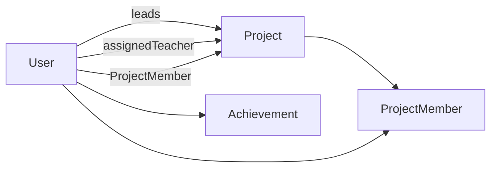

# Database overview

TrackLab uses **PostgreSQL** as its primary database. The app talks to the database through **Prisma ORM**: table structure and relations are declared in `prisma/schema.prisma`, and the running app uses a single shared **`PrismaClient`** instance from `lib/prisma.js`.

---

## Connection: `DATABASE_URL` and `schema.prisma`

### Datasource

In `prisma/schema.prisma`, the `datasource` block tells Prisma which database to use:

```prisma
datasource db {
  provider = "postgresql"
  url      = env("DATABASE_URL")
}
```

- **`provider`**: PostgreSQL.
- **`url`**: Read from the environment variable **`DATABASE_URL`** (set in `.env` locally and in your hosting provider in production). This string is the full connection URL (host, port, database name, user, password, SSL options as needed).

Prisma CLI commands (`migrate`, `generate`, `studio`, etc.) and the application at runtime both rely on this variable when connecting.

### Generator

```prisma
generator client {
  provider = "prisma-client-js"
}
```

This generates the **`@prisma/client`** package (TypeScript/JavaScript API) that you import in code. After changing the schema, run:

```bash
npx prisma generate
```

Migrations (when you use them) apply DDL changes to PostgreSQL; `generate` refreshes the client code to match.

---

## Runtime client: `lib/prisma.js`

```javascript
// lib/prisma.js (excerpt)
import { PrismaClient } from "@prisma/client";

const globalForPrisma = global;

const prisma =
  globalForPrisma.prisma ||
  new PrismaClient({
    log:
      process.env.NODE_ENV === "production"
        ? ["error"]
        : ["warn", "error"],
  });

if (process.env.NODE_ENV !== "production") globalForPrisma.prisma = prisma;

export default prisma;
```

### Why a global singleton?

In **Next.js**, route handlers and server code can be **hot-reloaded** during development. Creating a new `PrismaClient()` on every reload would open many connections and exhaust the database. The pattern above:

1. Reuses **`global.prisma`** in development so reloads attach to the same client.
2. In **production**, `global` caching is less critical, but the same module still exports one client per process.

### Logging

- **Production**: only Prisma **`error`** logs (quieter, less noise).
- **Non-production**: **`warn`** and **`error`** (helps catch slow queries and issues while developing).

### Usage in the app

API routes and server modules import the default export:

```js
import prisma from "@/lib/prisma";
```

All queries (`findMany`, `create`, `$transaction`, etc.) go through this instance.

---

## Schema design: what each model does

The schema models **users**, **projects**, **membership**, **achievements**, **logging**, and supporting tables. Below is how they fit the product.

### `User`

Core account for anyone using the system.

| Field | Purpose |
|--------|--------|
| `id` | Primary key (UUID). |
| `name`, `regId`, `email` | Identity; `regId` and `email` are unique. |
| `phoneNumber` | Optional contact (E.164 preferred). |
| `role` | `Role` enum: `STUDENT`, `TEACHER`, `ADMIN`, `SUPER_ADMIN` (access control). |
| `branch`, `section`, `batch` | Optional academic metadata (`Branch`, `Section`, `Batch` enums). |

**Relations:**

- **`projects`** (`ProjectLeader`): projects this user **leads**.
- **`assignedProjects`** (`ProjectAdmin`): projects where this user is the **assigned teacher** (`assignedTeacherId`).
- **`projectMemberships`**: rows in `ProjectMember` when this user is a **team member** (not the leader).
- **`achievements`**: linked `Achievement` records.

### `Project`

A lab / idea project owned by a **leader** (`leaderId` → `User`).

| Field | Purpose |
|--------|--------|
| `title`, `components`, `summary`, `projectPhoto` | Content and metadata; `teamMembers` is a **string** (legacy/display JSON or text—see app code). |
| `status` | `PARTIAL` (draft) vs `SUBMITTED` (finalized). |
| `assignedTeacherId` | Optional teacher assigned to supervise (`User` via `ProjectAdmin`). |

**Relations:**

- **`leader`**: required; cascade delete removes project if leader user is deleted (per `onDelete: Cascade` on the FK).
- **`members`**: `ProjectMember[]` for **registered** team members (used for permissions and listing).

### `ProjectMember`

Join table: **which users are official members of which project** (beyond the leader). This enables “team members see the leader’s project” and scoped access in APIs.

| Constraint | Purpose |
|------------|--------|
| `@@unique([projectId, userId])` | One membership row per user per project. |
| `@@index([userId])` | Efficient lookups of all projects for a given user. |

Both FKs use **`onDelete: Cascade`** so deleting a user or project cleans up memberships.

### `Student`

Lightweight table keyed by **`regId`** (registration ID). Used where the app references students by registration id without tying every row to `User` (see usage in codebase).

### `Achievement`

Achievements tied to a **`User`** (`userId`), with title, description, optional image, and a string **`type`** (e.g. student vs faculty in app logic).

### `IdealabProject`

Showcase / Idea Lab catalog entries (name, description, GitHub link, image)—separate from student **`Project`** records.

### `Overlord`

Separate small table for **superuser / overlord** accounts (name, email), used by the app’s superuser flows.

### `AdminLog`

Append-only style **audit log**: `message`, `type`, optional **`metadata`** JSON, `createdAt`. Indexed by `createdAt` and `type` for admin and monitoring queries.

---

## Enums

| Enum | Values (summary) |
|------|-------------------|
| **`Status`** | `PARTIAL`, `SUBMITTED` — project lifecycle. |
| **`Role`** | `STUDENT`, `TEACHER`, `ADMIN`, `SUPER_ADMIN`. |
| **`Branch`**, **`Section`**, **`Batch`** | Fixed sets for college structure (branch of study, section letter, batch code). |

Enums keep invalid values out of the database and align with TypeScript types generated by Prisma.

---

## Relationship overview



- One **User** can lead many **Projects**.
- One **Project** has one **leader** and optionally one **assigned teacher** (another `User`).
- Many **Users** can be **members** of a project via **ProjectMember**.

---

## Typical workflows

1. **Migrations**: After editing `schema.prisma`, create/apply migrations (`npx prisma migrate dev` in development) and commit migration files.
2. **Client refresh**: Run `npx prisma generate` whenever the schema changes (often automatic after migrate).
3. **Inspection**: `npx prisma studio` opens a GUI to browse tables (development only; protect credentials).

For API-level behavior (who can read which project), see application code under `lib/projectAccess.js` and route handlers; the **schema** provides the foreign keys and join rows those checks rely on.
